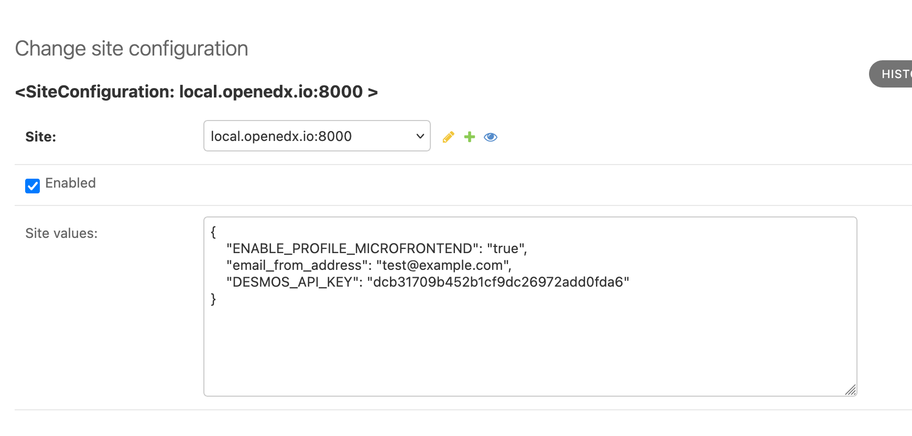
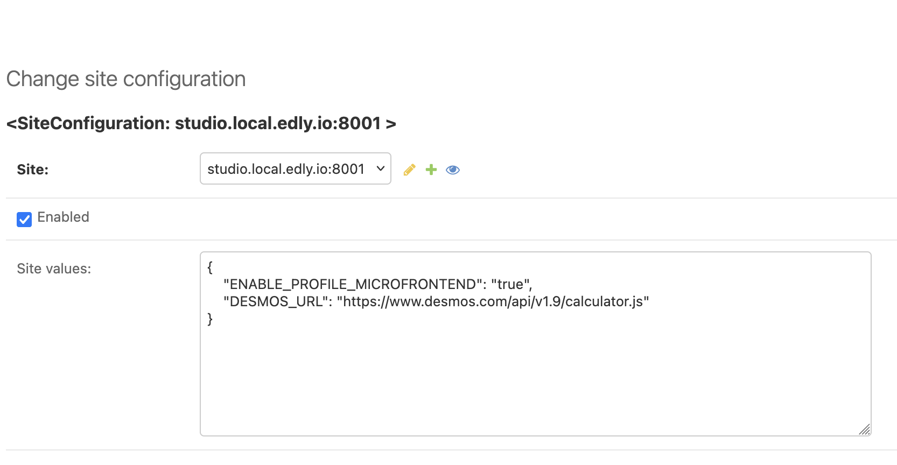

# GraphXBlock

An Open edX XBlock that embeds a **Desmos Graphing Calculator** so learners can plot mathematical expressions. Authors can optionally seed a default equation and configure the Desmos API key.

---

## Features

- Desmos Graphing Calculator embedded in course content
- Optional **seed equation** shown on load
- Configurable **Desmos API key**
- Works in LMS (student view), Studio preview (author/preview), and the XBlock SDK Workbench
- Add seed equation to the XBlock
- Hide seed equation from the expression list.
- Change the style of the line and add labels to axis.

---

## Enabling in Studio

1. Install the package in **both** LMS and CMS environments.
2. Restart services (e.g., with Tutor: `tutor dev restart lms cms`).
3. In **Studio → Course → Advanced Settings**, add the entry point key to `advanced_modules`, i.e.:
   ```json
   ["graphxblock"]
   ```

---

## Usage

The API Key can be configured in two ways:

1. In the Studio when you are adding units in the course.
2. Adding DESMOS_API_KEY in the site configuration. Like shown in the image below. This needs to be done for CMS and LMS.



Add **GraphXBlock** to a unit (Components → Advanced). Configure:

- **Desmos API Key**: Use your own key or the Desmos demo key.
- **Seed Equation**: If the author wanted to add a default graph to the sheet.
  Example: `y = x^2`
- Style configurations of the seeded equation of the graph.
- Adding labels to the axis.
- **Hide Expression**: In case the author wanted to show graph without showing the equations.
- **Save State**: This can be switched on if author wants the student to save the work on the graph sheet.

The block constructs the script URL like:
```
https://www.desmos.com/api/v1.9/calculator.js?apiKey=<api_key>
```


In case we want to self-host DESMOS script and we want to use a custom URL, it can be achieved by adding DESMOS_URL
to site configuration.



---

### Developing this XBlock on Tutor

Clone this repo under:

```bash
{tutor config printroot}/env/build/openedx/requirements
```

:: Note If the directory doesn't exists please create it.

Add a `private.txt` under the `requirements` directory.
Add

```bash
-e ./graphxblock
```

We need to mount the XBlock

```bash
tutor mounts add ./graphxblock
```

Stop all containers

```bash
tutor dev stop
```

Re-build the image

```bash
tutor images build openedx-dev
```

Restart the containers

```bash
tutor dev start -d
```
Once this is done the XBlock should be installed in LMS and CMS.
